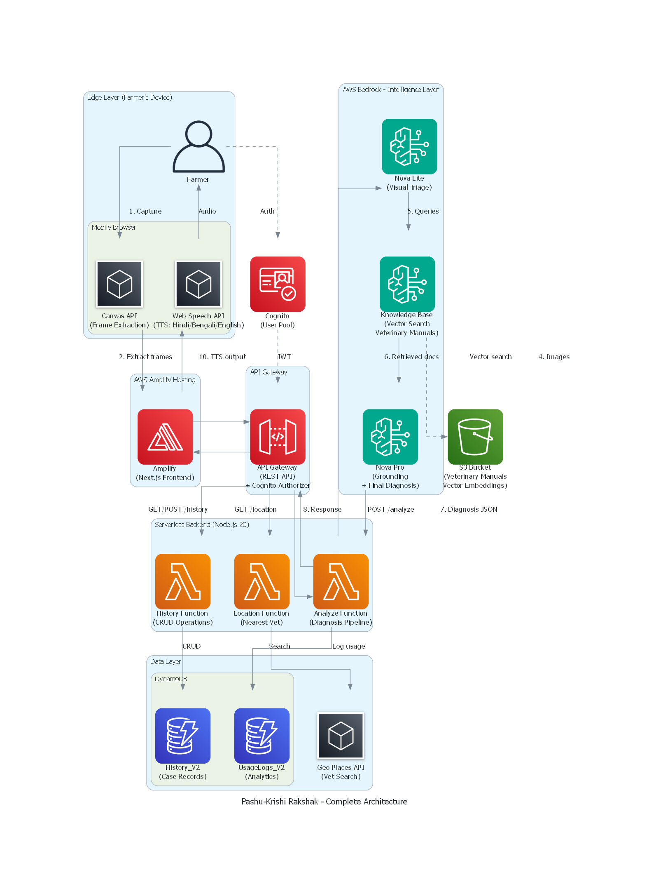
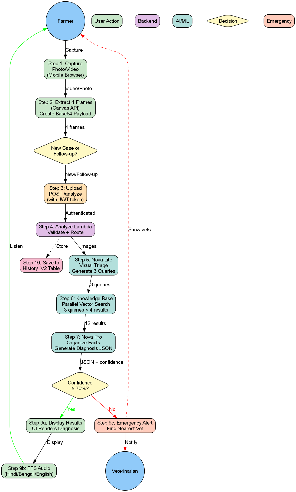

# AWS Architecture - Pashu-Krishi Rakshak

## Architecture Diagrams

### Complete System Architecture

### User Process Flow

## Overview

Pashu-Krishi Rakshak (Animal-Crop Guardian) is a serverless agricultural AI diagnostic system built on AWS that enables farmers to diagnose animal and crop diseases using their mobile devices.

---

## Architecture Components

### 1. Edge Layer (Farmer's Device)
- **Farmer (Mobile Browser)**: Primary end-user accessing the system via mobile web browser
- **Canvas API**: Client-side frame extraction from video (4 key frames)
- **Web Speech API**: Browser-native Text-to-Speech in Hindi, Bengali, and English
- **Veterinarian**: Receives emergency alerts for low-confidence diagnoses

### 2. Hosting Layer
- **AWS Amplify**: Hosts Next.js frontend application with automatic deployments
- **Static Assets**: React components, CSS, JavaScript bundles

### 3. Authentication Layer
- **Amazon Cognito**: User pool for authentication and authorization
- **JWT Tokens**: Secure API access with token-based auth

### 4. API Layer
- **Amazon API Gateway**: REST API with Cognito authorizer
  - `POST /analyze` - Diagnosis pipeline
  - `GET/POST /history` - Case management
  - `GET /location` - Nearest vet finder

### 5. Serverless Backend (Node.js 20)
- **Analyze Lambda Function**:
  - Receives 4 base64-encoded image frames
  - Orchestrates the entire diagnostic pipeline
  - Manages communication between Bedrock services
  - Handles response formatting and error handling
  - Logs usage to DynamoDB
  
- **History Lambda Function**:
  - CRUD operations for case history
  - Retrieves past diagnoses for follow-up analysis
  - Manages History_V2 table
  
- **Location Lambda Function**:
  - Integrates with AWS Geo Places API
  - Finds nearest veterinary services
  - Returns name, address, and distance

### 6. AI/ML Layer (Amazon Bedrock)

#### Nova Lite
- **Purpose**: Initial visual triage and query generation
- **Input**: 4 image frames from Lambda
- **Output**: 3 targeted search queries for knowledge base

#### Knowledge Base
- **Purpose**: Vector search across veterinary documentation
- **Process**: Executes 3 parallel searches, returning 4 results each (12 total results)
- **Backend**: Connected to S3 with vector embeddings

#### Nova Pro
- **Purpose**: Final diagnosis generation
- **Process**: 
  - Organizes retrieved facts into categories:
    - Clinical findings
    - Epidemiological data
    - Regulatory information
  - Generates structured JSON diagnosis
- **Output**: Disease name, confidence score, medicines, care steps

### 7. Data Storage Layer

#### Amazon S3 (Veterinary Manuals)
- Stores veterinary documentation and agricultural guides
- Contains vector embeddings for semantic search
- Indexed by Bedrock Knowledge Base

#### Amazon DynamoDB
- **History_V2 Table**: Stores case history and diagnostic records
  - Case ID, timestamps, diagnoses, images
  - Follow-up tracking and progression analysis
- **UsageLogs_V2 Table**: Analytics and usage tracking
  - API calls, response times, error rates
  - User behavior and system performance metrics

#### Amazon Cognito
- User pool for authentication
- JWT token generation and validation
- User profile management

#### AWS Geo Places API
- Location-based veterinary service search
- Returns nearest vet clinics with address and distance
- Integrated into emergency alert flow

---

## Data Flow

### Complete User Journey (10 Steps)

1. **Capture**: Farmer captures photo/video via mobile browser
2. **Extract**: Canvas API extracts 4 key frames client-side from videos (photos sent directly), creates base64 payload
   - *Note: Currently extracts 4 frames from videos. See [Future Enhancements](#video-processing-optimization) for planned improvement to send full videos.*
3. **Authenticate**: User logs in via Cognito, receives JWT token
4. **Upload**: Frontend sends POST request to `/analyze` with JWT and images
5. **Route**: API Gateway validates token and invokes Analyze Lambda
6. **Triage**: Lambda sends 4 frames (or 1 photo) to Bedrock Nova Lite for visual analysis
7. **Search**: Nova Lite generates 3 queries, Knowledge Base performs parallel vector search (12 results)
8. **Synthesize**: Nova Pro organizes facts and generates structured JSON diagnosis
9. **Respond**: Lambda returns diagnosis to API Gateway → Frontend
10. **Present**: UI displays diagnosis, Web Speech API reads aloud in selected language

### Parallel Flows

- **Case History**: Analyze Lambda saves diagnosis to History_V2 table
- **Usage Logging**: All API calls logged to UsageLogs_V2 table
- **Emergency Alert**: If confidence < 70%, Location Lambda finds nearest vet

### Alternative Paths

- **Follow-up Diagnosis**: History Lambda retrieves past cases for context
- **Location Services**: Separate endpoint for vet finder functionality

---

## Key Features

### Serverless Architecture
- **No infrastructure management**: Fully managed AWS services
- **Auto-scaling**: Handles variable load automatically
- **Pay-per-use**: Cost-effective for agricultural use cases

### AI-Powered Diagnosis
- **Multi-modal input**: Photos and videos supported
- **Intelligent search**: Vector-based semantic retrieval
- **Structured output**: Consistent JSON format for easy parsing

### Performance Optimization
- **Parallel processing**: 3 simultaneous knowledge base queries
- **Edge caching**: CloudFront reduces latency globally
- **Optimized inference**: Bedrock provides fast AI responses

### Accessibility
- **Multi-language support**: Hindi, Bengali, English
- **Text-to-Speech**: Audio output for low-literacy users
- **Mobile-first**: Optimized for mobile browsers

### Safety & Reliability
- **Confidence scoring**: Transparent AI uncertainty
- **Emergency escalation**: Automatic vet alerts for uncertain cases
- **Case tracking**: Historical data for pattern analysis

---

## AWS Services Used

| Service | Purpose | Key Features |
|---------|---------|--------------|
| **Amplify** | Frontend Hosting | CI/CD, custom domains, HTTPS, automatic deployments |
| **Cognito** | Authentication | User pools, JWT tokens, OAuth 2.0, MFA support |
| **API Gateway** | API Management | REST API, Cognito authorizer, throttling, CORS |
| **Lambda** | Compute | 3 functions (Analyze, History, Location), Node.js 20, auto-scaling |
| **Bedrock (Nova Lite)** | AI/ML | Visual analysis, query generation, fast inference |
| **Bedrock (Knowledge Base)** | AI/ML | Vector search, RAG, semantic retrieval |
| **Bedrock (Nova Pro)** | AI/ML | Advanced reasoning, diagnosis generation, structured output |
| **S3** | Storage | Veterinary manuals, vector embeddings, high durability |
| **DynamoDB** | Database | 2 tables (History_V2, UsageLogs_V2), NoSQL, serverless |
| **Geo Places** | Location Services | Vet search, geocoding, distance calculation |
| **CloudWatch** | Monitoring | Logs, metrics, alarms, dashboards |
| **IAM** | Security | Roles, policies, least privilege access |

---

## Performance Metrics

- **Client-Side Frame Extraction**: <1 second (Canvas API)
- **API Gateway Latency**: ~50-100ms
- **Lambda Cold Start**: ~2 seconds (first invocation)
- **Lambda Warm Execution**: ~100-200ms
- **Bedrock Nova Lite**: ~1-2 seconds (visual triage)
- **Knowledge Base Search**: ~1-2 seconds (parallel queries)
- **Bedrock Nova Pro**: ~2-3 seconds (diagnosis generation)
- **Total End-to-End**: ~5-10 seconds
- **Cognito Auth**: ~100-200ms (token validation)
- **DynamoDB Operations**: <100ms (read/write)

---

## Security Considerations

### Authentication & Authorization
- API Gateway with IAM authentication
- Cognito for user management (future enhancement)
- Lambda execution roles with least privilege

### Data Protection
- HTTPS/TLS for all communications
- S3 encryption at rest
- DynamoDB encryption enabled
- VPC endpoints for private connectivity (optional)

### Compliance
- HIPAA-eligible services (Lambda, S3, DynamoDB)
- Data residency controls
- Audit logging via CloudTrail

---

## Cost Optimization

### Serverless Benefits
- **No idle costs**: Pay only for actual usage
- **Auto-scaling**: No over-provisioning
- **S3 Intelligent-Tiering**: Automatic cost optimization

### Estimated Monthly Cost (1000 diagnoses)
- **Amplify**: ~$5 (hosting + build minutes)
- **Cognito**: ~$0 (first 50,000 MAUs free)
- **Lambda**: ~$8 (3 functions, compute time)
- **Bedrock**: ~$50 (inference costs)
- **API Gateway**: ~$3.50 (API calls)
- **S3**: ~$2 (storage + requests)
- **DynamoDB**: ~$2.50 (on-demand, 2 tables)
- **Geo Places**: ~$4 (location searches)
- **CloudWatch**: ~$2 (logs + metrics)
- **Total**: ~$77/month

---

## Scalability

### Horizontal Scaling
- **Lambda**: Up to 1000 concurrent executions (default)
- **API Gateway**: 10,000 requests/second (default)
- **Bedrock**: Managed scaling by AWS
- **DynamoDB**: On-demand capacity mode

### Geographic Expansion
- **CloudFront**: 450+ edge locations worldwide
- **Multi-region**: Deploy Lambda in multiple regions
- **S3 Replication**: Cross-region for disaster recovery

---

## Monitoring & Observability

### CloudWatch Integration
- Lambda function metrics (invocations, duration, errors)
- API Gateway metrics (requests, latency, 4xx/5xx errors)
- Bedrock usage metrics
- Custom application metrics

### Logging
- Lambda logs to CloudWatch Logs
- API Gateway access logs
- X-Ray tracing for distributed debugging

### Alarms
- High error rates
- Increased latency
- Bedrock throttling
- DynamoDB capacity issues

---

## Future Enhancements

### Phase 2: Core Improvements

#### Video Processing Optimization
**Current Implementation:**
- Frontend extracts 4 key frames from videos using Canvas API
- Sends 4 JPEG images to backend (~100-200 KB total)
- Bedrock analyzes 4 static frames

**Proposed Enhancement:**
- Send full video files directly to Bedrock Nova
- Leverage Bedrock's native video understanding (1 FPS sampling)
- For 10-second video: 10 frames analyzed vs current 4 frames
- Better temporal understanding of disease progression

**Benefits:**
- More comprehensive analysis (2.5x more frames for typical videos)
- Simpler frontend code (remove frame extraction logic)
- Bedrock handles intelligent frame selection
- Better detection of movement-based symptoms (limping, tremors)

**Trade-offs:**
- Larger uploads (full video vs 4 images)
- Higher bandwidth costs (~5-10 MB vs 200 KB)
- Slightly higher Bedrock token costs (10 frames × 288 tokens = 2,880 tokens vs 4 frames × 288 tokens = 1,152 tokens)

**Implementation Notes:**
- Bedrock Nova supports MP4, MOV, WebM, MKV, FLV, MPEG, WMV, 3GP
- Videos ≤16 minutes: 1 FPS sampling
- Videos >16 minutes: Dynamic sampling (960 frames max)
- Max file size: 1 GB via S3 URI, 25 MB via base64
- All videos resized to 672×672 before processing
- No benefit from >30 FPS source videos

**References:**
- [AWS Bedrock Nova Video Understanding](https://docs.aws.amazon.com/nova/latest/userguide/modalities-video.html)
- [Gemini Video Processing](https://www.s-anand.net/blog/how-does-gemini-process-videos/)

#### Other Phase 2 Enhancements
- **Amazon Rekognition**: Additional image analysis for quality validation
- **AWS AppSync**: Real-time updates via GraphQL subscriptions
- **Amazon Translate**: Expand language support beyond Hindi/Bengali/English
- **Amazon Polly**: Enhanced TTS with neural voices

### Phase 3: Advanced Features
- **Amazon SageMaker**: Custom ML models for regional diseases
- **AWS IoT**: Integration with farm sensors and wearables
- **Amazon QuickSight**: Analytics dashboard for disease patterns
- **Amazon Connect**: Voice-based consultation with vets

### Phase 4: Scale & Offline
- **AWS Greengrass**: Edge computing for offline mode
- **Amazon Location Service**: Enhanced mapping and routing
- **Amazon Forecast**: Disease outbreak prediction
- **AWS Step Functions**: Complex workflow orchestration

---

## Deployment

### Infrastructure as Code
- **AWS SAM**: Serverless Application Model templates
- **CloudFormation**: Infrastructure provisioning
- **CI/CD**: Automated deployment pipeline

### Environments
- **Development**: Local SAM testing
- **Staging**: Pre-production validation
- **Production**: Live system with monitoring

---

## References

- [AWS Bedrock Documentation](https://docs.aws.amazon.com/bedrock/)
- [AWS Lambda Best Practices](https://docs.aws.amazon.com/lambda/latest/dg/best-practices.html)
- [Amazon Bedrock Knowledge Bases](https://docs.aws.amazon.com/bedrock/latest/userguide/knowledge-base.html)
- [AWS Well-Architected Framework](https://aws.amazon.com/architecture/well-architected/)

---

*Generated using AWS Diagram MCP Server*  
*Last Updated: March 9, 2026*
